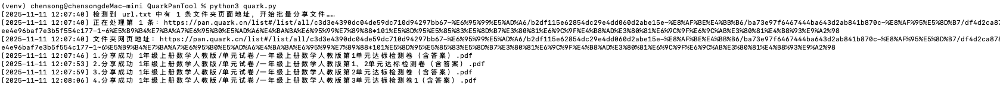

这是一个简单易用的小工具，旨在帮助用户快速批量生成分享链接

## 功能特点

- 运行稳定：基于playwright支持网页登录夸克网盘，无需手动获取Cookie。
- 批量分享：一键支持一次性遍历完所写的url文件下的所有文件分享链接，并输出为excel文件，无需手动点击分享文件。

## 如何使用

1.下载代码

```
git clone https://github.com/ihmily/QuarkPanTool.git
```

2.安装依赖

```
pip install -r requirements.txt
playwright install firefox
```

3.运行

```
python quark.py
```

## 注意事项

- 首次运行会比较缓慢，请注意底部任务栏，程序会自动打开一个浏览器，让你登录夸克网盘，登录完成后，请不要手动关闭浏览器，回到软件界面按Enter键，浏览器会自动关闭并保存你的登录信息，下次运行就不需要登录了。（如果是Linux环境，请自行在网页获取Cookie后填入config/cookies.txt文件使用）
- 执行批量转存之前，请先在url.txt文件中填写网盘分享地址（一行一个）。

## 效果演示




**免责声明**：本工具仅供学习和研究使用，请勿用于非法目的。由使用本工具引起的任何法律责任，与本工具作者无关。
